# Ghidaq - Flower Shop App

  <a href="https://github.com/vMohd/ghidaq-app">
    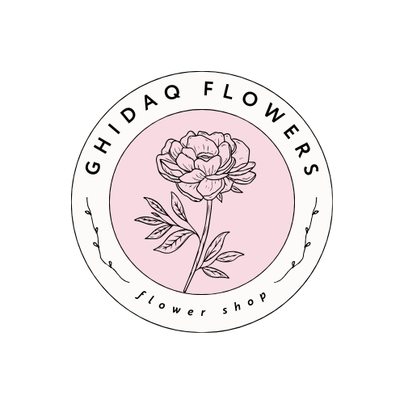
  </a>

## About Ghidaq
The Ghidaq Flowers App is a E-Commerce app. that provides a flower shop with various features. The project includes user authentication for login and registration, wide range of flowers for every occasions to shop with, withlist, and checkout process.
This project aims to create a smooth and enjoyable shopping experience for customers in the world of wonderful flowers. The project was developed as a part of the Microsoft LSA Club "Programming and application development" bootcamp.

The app was build using the low-code software [FlutterFlow](https://flutterflow.io/) and it is published to web 
The app database was built with Firebase

**Explore the app online : [Ghidaq Flowers](https://ghidaq-flowers.flutterflow.app)**

**Available for Android to download : [Ghidaq Flowers App](https://github.com/vMohd/ghidaq-app/releases/download/beta_android/GhidaqFlowers.apk)**

---

  
  
  

## Features

- User Authentication by Email : register, login, logout
- Shop by different occasions: happy birthday, get well soon, graduation, new baby born, weddings, I love you
- Display bestsellers and new arrivals products and full collection
- Ability to add products to wishlist
- Information pages: about, flowers care instructions
- Switch btween light and dark mode

## Screenshots

### Home page, Shop by Occasion

  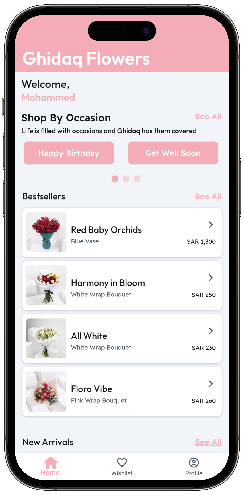
  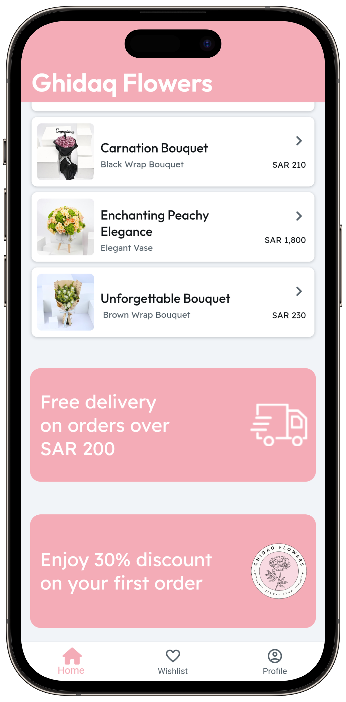
  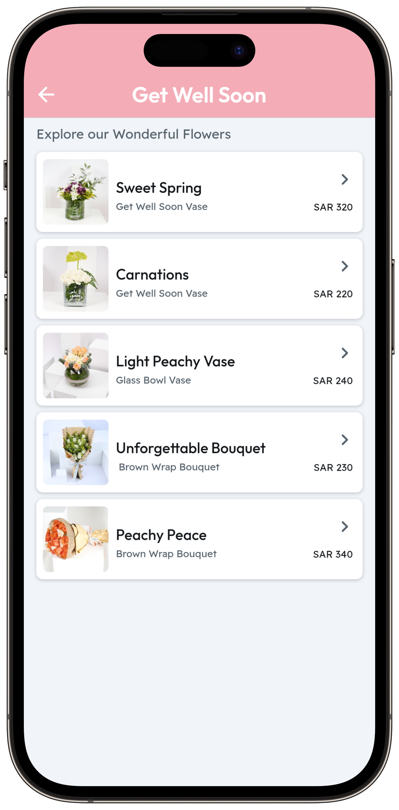

---

### Wishlist page

  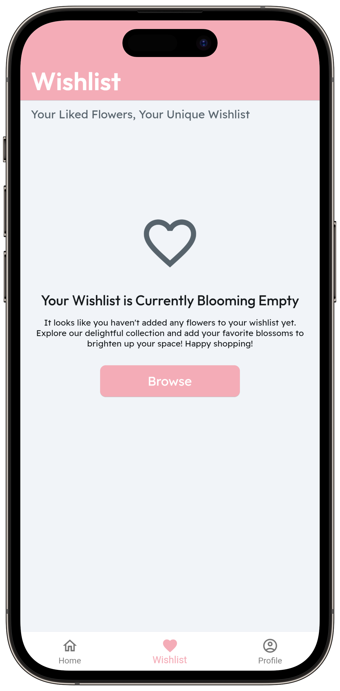
  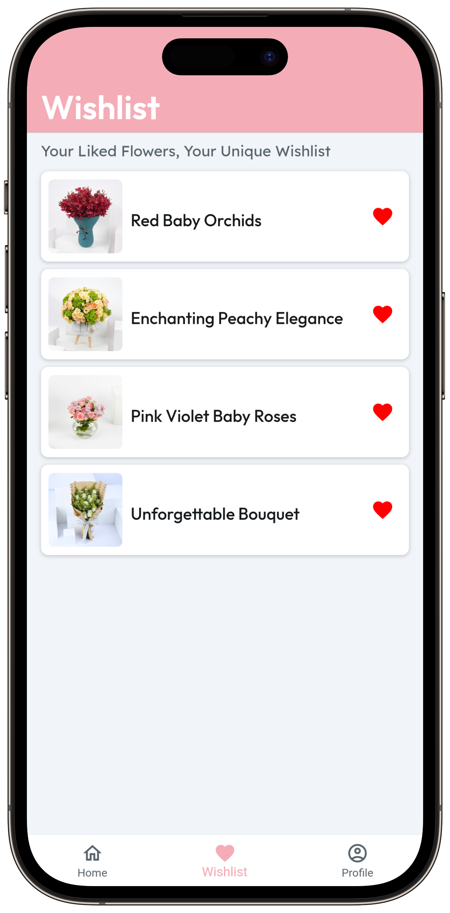

---

### item Details, Cart, Order Confirmed page

  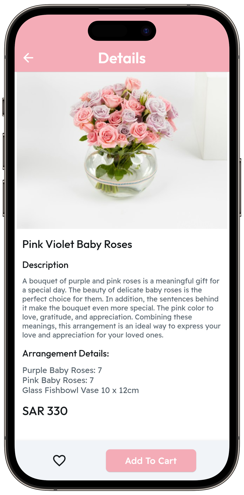
  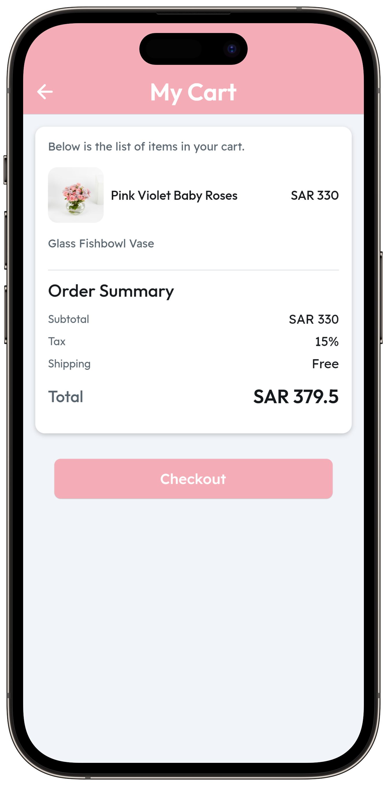
  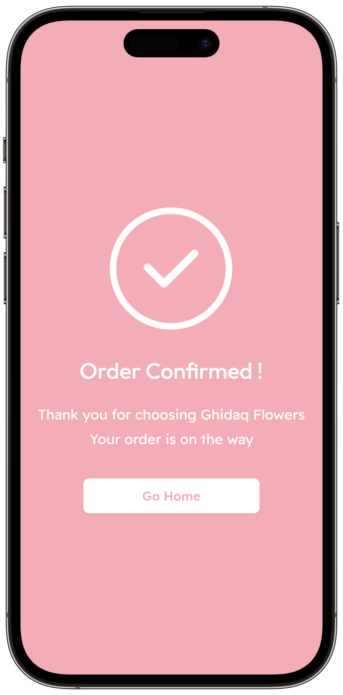

---

### Profile Section, Dark mode

  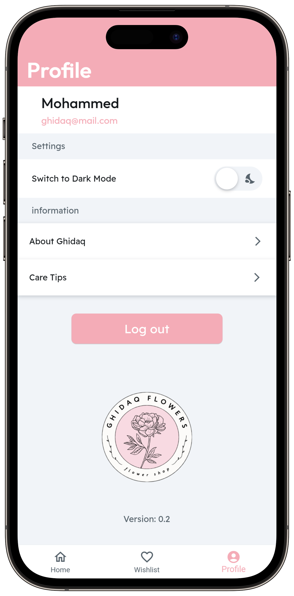
  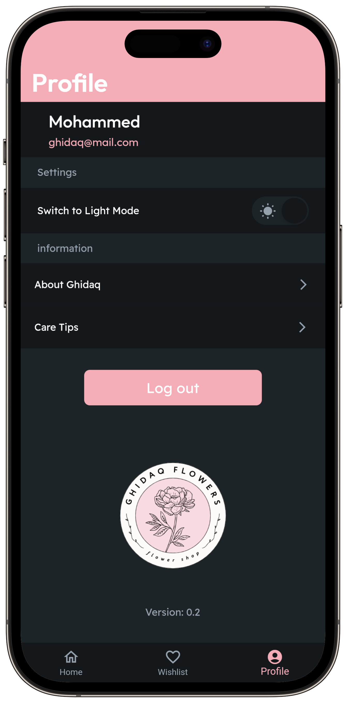

---

### Information pages

  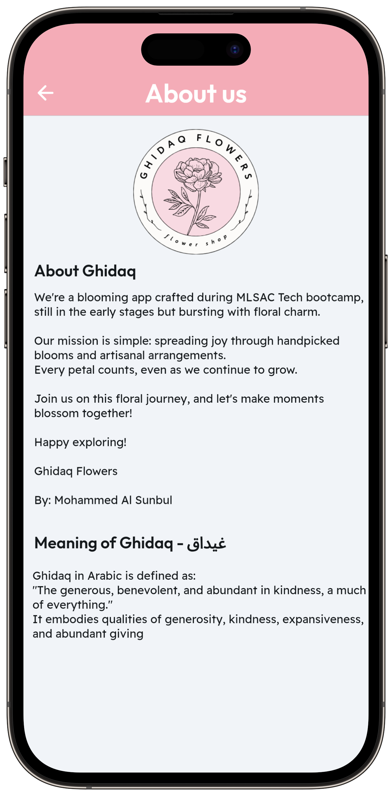
  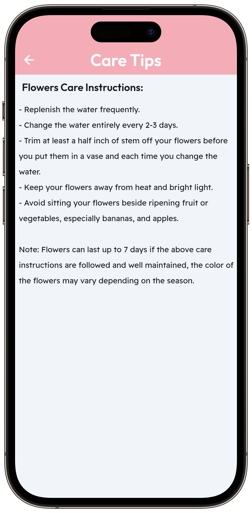

---

## Getting Started

FlutterFlow projects are built to run on the Flutter _stable_ release.
